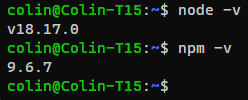

# tassaudio
Create 4/6-channel Audio files using Tass algorithm for Parkinsons therapy.

## Inspired by the following articles 

Coordinated Reset Vibrotactile Stimulation Induces Sustained Cumulative Benefits in Parkinson’s Disease
(Pfeifer KJ et al.)
https://www.ncbi.nlm.nih.gov/pmc/articles/PMC8055937/

Tass Vibrating Gloves: DIY, Hacks, Ideas, Prototypes...
(Snowski)
https://healthunlocked.com/cure-parkinsons/posts/148836810/tass-vibrating-gloves-diy-hacks-ideas-prototypes...

## Prerequisites
Make sure you have a working node.js installation on your system, which includes npm. Check by using the commands below, which should display the installed versions.

    node -v
    npm -v

The output should be similar to this:

If required, install them first.
Node.js can be downloaded from https://nodejs.org/ . This also includes the npm command.

## Installation
Download the latest release from https://github.com/csmale/tassaudio/releases .

Unpack the downloaded file (.zip or .tar.gz) into a convenient folder where the files can remain.

Use the following command to install tassaudio:

    npm install -g

## Usage
Usage: tassaudio [options]

Options:

    --debug                     Enable debug mode
    -q, --quiet                 Quiet mode
    -o, --out <value>           Output file (default: out_<time>.out)
    --duration <value>          Duration in deconds (default: 60)
    --max-amplitude <value>     Maximum amplitude (default: 32760)
    --sample-frequency <value>  Sample frequency (default: 22050)
    --jitter <value>            Jitter in percent (default: 23.5)
    --use-side-channels         Use Side L/R instead of Rear L/R (default: false)
    -6, --sixchan               Produce 5.1 channel output instead of 4.0 (C and LFE are silent)
    --intro <value>             Add introductory channel map check of N seconds on each channel
    -h, --help                  display help for command
